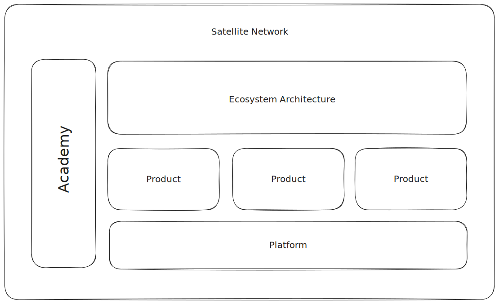

---
aliases:
- Ecosystem Builder
tags: []
title: Ecosystem Builder
---

# Ecosystem Builder

---

## Problem

Ecosystems often fall short in delivering the innovation they promise, due to a lack of trust among participants. Contrary to popular belief, money and technology alone cannot solve this problem.

---

## Solution

We are a studio that designs, develops, and deploys solutions that align stakeholders into high-trust ecosystems so that they can collectively conquer [black ocean](../../Notes/Black%20Ocean%20Strategy.md) markets.

---

## Principles

---

### Continuous JIT Learning

* We define ourselves as learning institution and communicate this upfront to prospects and recruits
* We document and publish all our learnings, both individually and collectively
* We invest in and utilize our own learning platform (Offcourse Next)

---

### Do Not Reinvent the Wheel

* Fully leverage ready-to-use software solutions (SAAS, BAAS, PAAS) 
* Avoid bespoke development work as much as possible
* Make use of Generative A.I. to both write and check our code
* We invest in and utilize our own infrastructure layer that allows us to quickly spin up new projects

---

### Maximize Ownership

* Each team works as a autonomous pod and has its own well-defined responsibilities and targets
* We surround ourselves with a satellite network of highly skilled and specialized professionals
* Pods are prepared for a spinout after a project is completed
* We truly stimulate ask for forgiveness not for permission 

---

## Proposition

Our studio specializes in multistakeholder projects with a strong focus on Ed- and HR-tech.

---

## Organization

---

### Ecosystem Architecture

Roles required: 

* Ecosystem Architect
* Ecosystem Orchestrator
* Service Designer 
* Software Architect
* Branding and Marketing Strategist 

---

### Product Team

Roles required: 

* Product Manager
* UX Designer
* UI Designer
* Software Engineers
* Growth Hacker

---

### Platform Team

Roles required:

* Senior Developers 

---

### Academy

Roles required:

* Curriculum Designer
* Lead Developers (1 per product team)

---

### Satellite Network

Our primary and only sales channel, the satellite network is a curated group of highly skilled professionals.

Roles required:

* Program Coordinator

---

## Approach

Our projects are always divided into four distinct phases. Each phase is followed by either an opt-in or opt-out from the stakeholders involved.

---

### 0. Acquisition

Activities: Workshops, Conference Talks, Knowledge Sharing

Teams Involved: Satellite Network

Deliverable: Proposal

---

### 1.  Alignment

Activities: Interviews, Mapping, Prototyping

Teams Involved: Ecosystem Architecture

Duration: 3 Months

Deliverable: *Vision Type* (30k cash)

---

### 2. Validation

Activities: Prototyping, Building, Growth Hacking

Teams Involved: Ecosystem Architecture, Product Team, Platform Team

Duration: 6 Months

Deliverable: *Vessel of Transformation* (250k cash)

---

### 3. Scale

Activities: Building, Growth Hacking

Teams Involved: Product Team, Platform Team

Duration: 1-2 Year

Deliverable: [Minimum Viable Ecosystem](../../Notes/Minimum%20Viable%20Ecosystem.md) (500k - 1m cash)

---

### 4. [Spinout](../../Notes/Spinout.md)

After this first three phases teams can either be acquired by the stakeholders involved, or spinout on their own as a separate venture.

Teams Involved: Product Team

Duration: none

Deliverable: *Empowered Product Team* (500k+ cash/equity)
